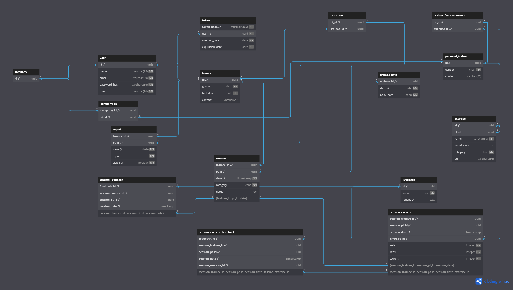

# Weekly Report 1

## Week: 7/03/2023 - 24/03/2023

## Summary

- **Week´s Objectives:**
    1. Structure the database.
    2. Structure the organization of the API code.
    3. Implement the authentication controller.
    4. Understand the functioning of Vue.js.
    5. Implement the login and signup page.
- **Progress:**
    1. The database was structured.
    2. The organization of the API code was done.
    3. The authentication controller was implemented, missing the signup for trainee and hired trainer, forget password reset password and unit tests.
    4. The functioning of Vue.js was understood.
    5. The login and signup page was implemented, missing only the integration with the API.

## Development Details

### Frontend

The development of the frontend of the application was started together with the backend, using the Vue.js framework, as mentioned in the project proposal.
A sidebar was created for navigation between pages using the router built into Vue.js, this component is reusable and is used throughout the application.
In addition, the implementation of the Signup page was started, which has a form for registration on the platform, with specific fields for individual personal trainers and companies. The page also has a switch button that allows to switch between the Signup layouts of individual personal trainers and companies, so that the user can choose the type of account they want to create and show the fields necessary for each type of account.

The functionalities of Vue.js used were:

- **Template:** Defines the visual structure of the component. The HTML code uses conditional classes to control the presentation of the sidebar. The `is_open` class is reactive and controls the complete (`side-bar-container-open`) or compact (`side-bar-container`) display of the sidebar.

- **Script Setup:** This section written in Typescript provides the component's behavior logic. Here, the Vue ref feature was used to create a reactive state `is_open` that controls the opening or closing of the sidebar, the value of the filled fields or the switch that changes the Signup layouts.

- **Routing:** The `router-link` component is used to create navigable links between the application's routes (home, about, signup).

- **Scoped Styles:** The `<style scoped>` section of a component in Vue defines CSS styles encapsulated in the component, avoiding conflicts with other styles in the application.

- **Reusable Components:** The `SideBar` component is reusable and is used throughout the application for navigation between pages.

- **Directives:** The `v-if` directive is used to control the display of HTML elements based on a reactive expression.

- **Events:** The `click` event is used to control the opening and closing of the sidebar.

- **Data Binding:** Vue.js uses data binding syntax to bind model data to HTML elements. The `v-model` directive is used to bind the value of the fields filled in the Signup form.

---

### Backend

#### Database

The database was structured with the following tables:

- `user`: stores user data.
- `token`: stores authentication tokens.
- `company`: stores company data.
- `personal_trainer`: stores personal trainer data.
- `company_pt`: stores the data of the relationship between companies and personal trainers.
- `trainee`: stores trainee data.
- `pt_trainee`: stores the data of the relationship between personal trainers and trainees.
- `trainee_data`: stores trainee extra data.
- `report`: stores report data.
- `session`: stores training session data.
- `exercise`: stores exercise data.
- `trainer_favorite_exercise`: stores personal trainer favorite exercises data.
- `session_exercise`: stores training session exercise data.
- `feedback`: stores feedback data.
- `session_feedback`: stores the data of the relationship between sessions and feedbacks.
- `session_exercise_feedback`: stores the data of the relationship between session exercises and feedbacks.

The structure was made according to the diagram below:





In the implementation of the database, two schemas were created, `prod` and `dev`, the first for production and the second for development (for testing the JDBI functions).

---

#### API

In the API, the authentication controller was implemented, missing only the implementation of the signup for trainee and hired trainer, forget password reset password and unit tests for the implemented methods.

The implemented methods followed the following structure:

- `POST /api/signup`
    This method registers a new user identified by the `user_type` field, which can be `company` and `independent_trainer`.
    It was chosen this method for user registration, to centralize the creation of users, avoiding the creation of several methods for each type of user.
    This way, the method receives a JSON object with the fields necessary for the creation of a user, and creates a user with the type specified in the `user_type` field.

    **Possible bodys for the method:**

  - **Company**;

    ```json
    {
        "name": "string",
        "email": "string",
        "password": "string",
        "user_type": "company"
    }
    ```

  - **Independent Trainer**;

    ```json
    {
        "name": "string",
        "email": "string",
        "password": "string",
        "gender": "string",
        "phoneNumber": "string?",
        "user_type": "independent_trainer"
    }
    ```

    For the deserialization of the JSON objects in this method, a class `SignupRequest` was created that contains two `data classes`, `Company` and `IndependentTrainer`, which are used for the deserialization of the JSON objects through annotations of the `Jackson` library, as explained in the `Attachments` section.

---

- `POST /api/auth/signup`
    This method, not yet implemented, registers a new user identified by the `user_type` field, which can be `hired_trainer` and `trainee`, as done in the `POST /api/signup` method, to centralize the creation of users.
    However, for this method to register the users mentioned above, it is necessary that it be registered by an authenticated user (company or personal trainer). As such, it was decided to create a separate method for the registration of these users that require authentication.
    For the registration of a `hired_trainer` user, it is necessary that the authenticated user is a company, and for the registration of a `trainee` user, it is necessary that the authenticated user is a personal trainer or a company.

    **Possible bodys for the method:**

  - **Hired Trainer**;

    ```json
    {
    "name": "string",
    "email": "string",
    "gender": "string",
    "phoneNumber": "string?",
    "user_type": "hired_trainer"
    }
    ```

  - **Trainee**;

    ```json
    {
        "name": "string",
        "email": "string",
        "birthdate": "string",
        "gender": "string",
        "phoneNumber": "string?",
        "user_type": "trainee"
    }
    ```

---

- `POST /api/login`
    This method authenticates a user, checking if the email and password provided correspond to a user in the database.
    The method receives a JSON object with the fields `email` and `password`, and returns a JSON object with the authentication token, which is used to authenticate the user in future requests, and an expirationDate that indicates the token expiration date.
    This method, when verifying the user's credentials, creates an authentication token that is stored in the database, and returns it to the user, and creates a cookie with this token, which is used to authenticate the user in future requests.

    **Possible bodys for the method:**

    ```json
    {
        "email": "string",
        "password": "string"
    }
    ```

---

- `DELETE /api/auth/logout`
    This method logs out a user, deleting the authentication token from the database and the cookie.
    The method receives a cookie, named `access_token`, or a header `Authorization` with the value `Bearer Token`, where `Token` is the user's authentication token, and returns a JSON object with the message `User logged out successfully`.

---

All methods that require authentication receive an authentication token in the request header or in a cookie, as such any request made to these methods goes through an interceptor that checks if the token is valid and delivers it to the method handler the received token, the id of the authenticated user, for access to user information present in the database, and the role of the user to verify if the user has permission to access the method.

---

#### Docker

A `Dockerfile` was created to create a Docker image of the database with PostgreSQL. This image receives the two `.sql` files with the script for creating the database and tables, which are executed when the image is created, and a `docker-compose.yml` file to create a container with the database.

## Planning for Next Week

- **Objectives:**
    1. Finalize the implementation of the authentication controller and respective unit tests.
    2. Start implementing the user controller.
    3. Integration of the Signup and Login page with the API.
    4. Implement the password recovery page.
    5. Implement the user profile page.

## Attachments

### Deserialization using Jackson annotations

#### Jackson annotations exeplaination

The annotations used in this project for deserialization were as follows::

- `@JsonTypeInfo`: class/property annotation used to indicate details of what type information is included in serialization, as well as how;
- `@JsonSubTypes`: class annotation used to indicate sub-types of annotated type; necessary when deserializing polymorphic types using logical type names (and not class names);
- `@JsonTypeName`: class annotation used to define logical type name to use for annotated class; type name can be used as `Type Id` (depending on settings of `@JsonTypeInfo`).

#### Deserialization process

When Spring receives an HTTP request with a *JSON body*, it uses the Jackson library to convert this *body* into a `Kotlin` object. In the conversion of the *body* to an object, it is indicated to Jackson through the annotations, `@JsonTypeInfo`, `@JsonSubTypes` and `@JsonTypeName` how it should determine which subclass should be used to proceed with the deserialization.

For the example of the `SignupRequest` class, present in the project, the deserialization process uses 3 annotations:

1. `@JsonTypeInfo` tells Jackson to analyze the value of the `user_type` property, present in the *body* of the request, to determine which subclass should be used in the deserialization process;
2. `@JsonSubTypes` maps the possible values for the `user_type` property to the respective subclasses of `SignupRequest`;
3. `@JsonTypeName` this annotation is used to specify the name that will be used in the JSON to represent a certain subclass. This name will be used in the property specified in the `@JsonTypeInfo` annotation.
When a request is received with a *body*, Jackson will create an instance of the appropriate subclass, analyzing the `user_type` property and following the mappings made by the annotations, and fills its fields with the values present in the *JSON*.

### References

- [Jackson Annotations](https://github.com/FasterXML/jackson-annotations/wiki/Jackson-Annotations)
