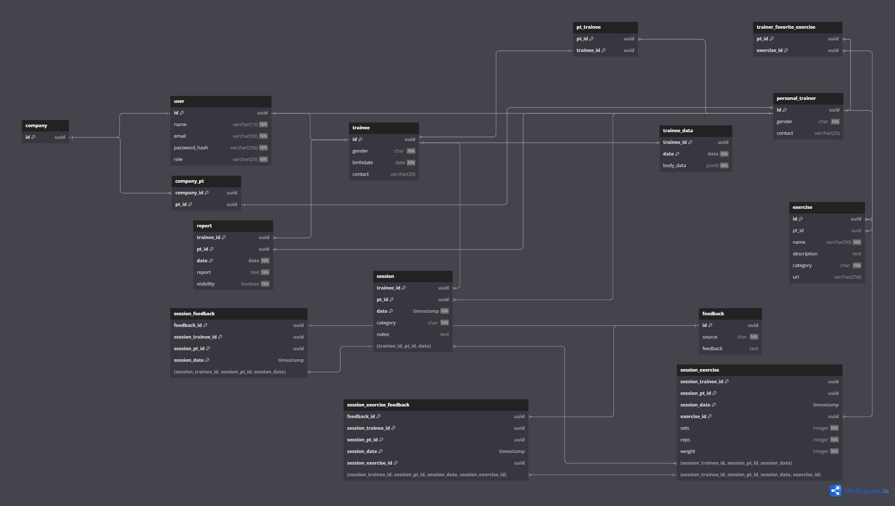

# Weekly Report 2

## Week: 25/03/2023 - 31/03/2023

## Summary

- **Week´s Objectives:**
    1. Finalize the implementation of the authentication controller and respective unit tests.
    2. Start implementing the user controller.
    3. Integration of the Signup and Login page with the API.
    4. Implement the password recovery page.
    5. Implement the user profile page.
- **Progress:**
    1. The authentication controller was implemented, missing only the implementation of the signup for trainee and hired trainer and forget password.
    2. Changed the token generation method to use the `JJWT` library.
    3. The implementation of the user controller was not started.
    4. The Signup page was integrated with the API.
    5. Documentation has been made for Vue.js, Vite and JWT libraries used in the project.
    6. Tested the API with Postman.
    7. Database unit tests were implemented.
    8. The password recovery page was not implemented.
    9. The user profile page was not implemented.

## Frontend Documentation

### What is Vue.js?

Vue.js is a progressive and reactive JavaScript framework. This framework is widely used to develop user interfaces and single-page applications.

The main features of Vue.js are:

1. **Reactivity**: Vue.js has a built-in reactivity system. This means that the user interface is automatically updated when the underlying data changes, ensuring state management.

2. **Progressive**: Vue.js is designed to be adopted incrementally. You can start using Vue.js in a small part of an existing project and expand its use as needed.

3. **Versatile**: Vue.js can be used to develop a variety of applications, from small interactive user interfaces to large-scale applications.

4. **Performance**: Vue.js has an optimized rendering system by the compiler that rarely requires manual optimization. This helps ensure that Vue.js applications are fast and efficient.

---

### Vue.js vs React

Vue.js and React.js are two popular tools for creating web applications in JavaScript. Both have their own advantages and disadvantages, and the choice between the two usually depends on the specific needs of your project.

Here are some key comparisons:

1. **Reactivity**: Vue.js has a built-in reactivity system, what means that the user interface is automatically updated when the underlying data changes.

2. **State Management**: Vue.js has a simpler and more intuitive state management system compared to React.js. With Vue.js, you can easily manage the state of the application using the built-in reactivity system and Vuex, while React.js requires additional libraries like Redux and MobX for state management.

3. **Performance**: Both Vue.js and React.js use a virtual DOM to optimize rendering performance. However, Vue.js has a more efficient rendering system by the compiler, which rarely requires manual optimization.

4. **Syntax**: Vue.js uses HTML templates and JSX to create components, while React.js uses JSX exclusively.

5. **Data Binding**: Vue.js uses two-way data binding by default, which means that every time a change is made in the UI it will be automatically reflected on the data and vice-versa. React.js only uses one-way data binding, requiring the update of the UI every time the data changes.

---

### What is Vite?

Vite is a build tool for modern web development. It is designed to be fast and lightweight, providing a faster development experience compared to traditional build tools like Webpack.

The main features of Vite are:

1. **Fast Development**: Vite uses native ECMAScript module imports to serve your code directly to the browser without bundling it first. This results in faster build times and a more responsive development experience.

2. **Hot Module Replacement**: Vite supports hot module replacement out of the box, allowing you to see changes in your code reflected in the browser without having to refresh the page.

3. **Optimized Production Builds**: Vite generates optimized production builds using Rollup, resulting in smaller bundle sizes and faster load times for your application.
    - **Rollup**: Rollup is a module bundler for JavaScript that compiles small pieces of code into larger, more complex modules or libraries. It is used by Vite to generate optimized production builds. Rollup supports the functionality of "tree shaking", which allows it to eliminate code that is not used in the final version of the package. This results in cleaner and more efficient code. In addition, Rollup has native support for ES6 modules, which means it can take advantage of the import and export functionality of ES6 modules to create packages that are smaller and more efficient.

---

### Vite vs Webpack

Vite and Webpack are both build tools for modern web development, but they have different approaches to building and bundling applications.

Here are some key comparisons:

1. **Development Experience:**

    - **Vite**: Vite uses native ECMAScript module imports to serve your code directly to the browser without bundling it first, resulting in faster build times and hot module replacement out of the box.

    - **Webpack**: Slower startup due to pre-compilation, potentially longer build times for large projects.

2. **Bundling:**

    - **Vite**: Vite, uses native ECMAScript module imports to serve your code directly to the browser without bundling it first, resulting in smaller bundle sizes and faster load times for your application.

    - **Webpack**: Webpack is a module bundler that bundles all your code into a single file, which can result in larger bundle sizes and slower build times.

3. **Configuration:**

    - **Vite**: Simpler and more intuitive configuration, perfect for beginners or projects prioritizing speed.

    - **Webpack**: More complex configuration offering granular control, better suited for experienced developers handling intricate projects.

4. **Optimized Production Builds:**

    - **Vite**: Uses Rollup for smaller production bundles and faster loading times.

    - **Webpack**: Requires additional configuration and plugins to achieve the same level of optimization as Vite.

---

## Backend Documentation

### JWT Authentication

For the implementation of JWT authentication, the `io.jsonwebtoken` library was used, which is an implementation of the JWT specification for Java. The library is responsible for generating and validating JWT tokens, allowing user authentication in the application.

#### Token Generation

The information of the user encapsulated in the JWT token are:

- **ID**: unique identifier of the user;
- **Subject**: user's role;
- **Issued At**: token issuance date;
- **Expiration**: token expiration date.

The token is generated from this information and a secret key, which is used to sign the token and ensure its authenticity.
For the generation of the token, an empty `HashMap` is created that will store the additional information of the token, such as the ID and the user’s role. Then, an object of type `JwtBuilder` is constructed, through the call to the `Jwts.builder()` method, being responsible for generating the JWT token with the repetitive information. With this object, the `setClaims()` method is then called, which receives the previously created empty `HashMap`, in this way using the `setId()`, `setSubject()`, `setIssuedAt()`, and `setExpiration()` methods, the user’s information is added to the token. Finally, the `signWith()` method is called, which receives the signature algorithm and the secret key, returning the generated JWT token. Finally, the `JwtBuilder` object is compacted to a String through the `compact()` method.

#### Integration with Cookies

The approach used for integrating JWT with cookies goes beyond storing the JWT token value in the cookie, it also stores the token expiration date (the same date that is present in the JWT token). In this way, it is possible to verify if the token is still valid on the client side, without the need to make a call to the server to validate the token or decode the JWT token to obtain the expiration date. Furthermore, this approach allows that when the token is validated on the server side, it is verified if the expiration date of the token present in the cookie is equal to the expiration date of the JWT token, thus ensuring the greatest authenticity of the token.

#### Token Information Reading

The reading of the JWT token information is done through the call to the `Jwts.parser().setSigningKey()` method that receives the token signature key, returning an object of type `Claims`. Then, the `parseClaimsJws()` method is called, which receives the `String` JWT token, returning the token information. Finally, the `body` parameter of the `Claims` object is used to obtain the token information.

---

## Database changes

Since there was a change in the way the user is authenticated through the token to use the JWT, it was necessary to change the way the token is generated and validated, so it was no longer necessary to store the token in the database, since the token is generated and validated from a secret key stored on the server as an environment variable.

With changes the database was updated resulting in the followiing diagram:

## Planning for Next Week

- **Objectives:**
    1. Finalize the authentication routes unit tests.
    2. Implement forget password and signup for trainee and hired trainer.
    3. Start implementing the user controller.
    4. Implement the password recovery page.
    5. Implement the user profile page.

### References

- [JJWT Documentation](https://javadoc.io/doc/io.jsonwebtoken/jjwt-api/latest/index.html)
- [Vue.js](https://vuejs.org/)
- [W3schools](https://www.w3schools.com/vue/index.php)
- [sitepoint](https://www.sitepoint.com/vue-vs-react/)
- [Fulcrum](https://fulcrum.rocks/blog/vue-vs-react-comparison)
- [Vite Guide](https://vitejs.dev/guide/)
- [Vite vs Webpack](https://vitejs.dev/guide/comparisons.html#vite-vs-webpack)
