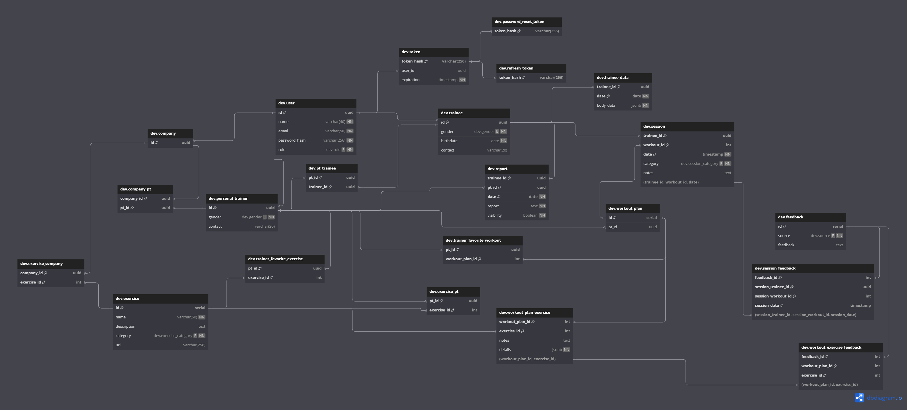

# Weekly Report 4

## Week: 08/04/2024 - 14/04/2024

## Summary

- **Week´s Objectives:**
    1. Finalize the authentication routes unit tests.
    2. Make the necessary adjustments to the authentication routes.
    3. Implement signup for trainee and hired trainer.
    4. Improve backend error handling.
    5. Start implementing the user controller.
    6. Improve frontend error handling.
    7. Implement the reset password page.
    8. Implement the user profile page.
    9. Implement the trainer and hire trainer signup page.
- **Progress:**
    1. Missing only the controller tests for the authentication routes and some tests for some routes.
    2. Refactored some authentication routes responses.
    3. Updated the authentication interceptor to handle to check if the user autehnticated has the necessary roles to access the route.
    4. Implemented the signup for trainee and hired trainer.
    5. Started implementing the user controller and company controller.
    6. implemented the reset password page.
    7. Impleted vuex in the views already implemented.

---

## Frontend changes

During this week, was made some significant changes to the existing views of the application. The implementation of Vuex with the Persist plugin and the use of ref and computed to make components and properties reactive.

**Implementation of Vuex with Persist Plugin:**
**Vuex** is a state management library for **Vue.js** applications, allowing centralization of shared state throughout the application. With the introduction of Vuex, **one can maintain a global state accessible to all parts of the application**, facilitating data management and sharing information between components.

Additionally, **the Persist plugin**, an extension of Vuex, **enables the persistence of the application's state between user sessions**. This means that even after the user refreshes the page or closes the browser, **the information stored in the Vuex state remains intact**, providing a more consistent and personalized experience.

**Use of Ref and Computed for Reactive Components:**
To make components more reactive and dynamic, the user used **ref** and **computed** in various parts of the application. **Ref** is a tool that allows direct access to HTML elements or Vue components at runtime. **Computed** is used to create computed properties that are automatically updated whenever their dependencies are modified.

By using these tools, the user was able to create more efficient and responsive components, ensuring a smoother and more interactive user experience. With **ref**, they could access and manipulate DOM elements directly, while **computed** allowed them to create properties that are automatically updated based on other properties, eliminating the need for manual and redundant updates.

---

## Backend changes

It was implemented the signup method for trainee and hired trainer, this will receive the access token of the user that is performing the registration. This will be verified when passing through the authentication interceptor, after this it is passed to the responsible handler the *userId* and *role* of the user, this will verify if the user is of the type *company* or *independent trainer*. If the user is of the type *company*, it is possible to register a new user of the type *hired trainer* or *trainee* on the platform, if the user is of the type *independent trainer*, it is only possible to register a new user of the type *trainee* on the platform.

The approach used to process the different types of ```body``` was the same used for the *signup* method for *company* and *independent trainer*, where the annotations of the *Jackson* library were used to map the ```body``` to an object of the type indicated by the *user_type* field. This was done to avoid having to create a method for each type of user, which would be necessary if the *user_type* field was not used.

The call to this method the user responsible for the registration will provide some basic information such as name, email, then an email is sent to the provided email with a link that allows the user to register their password, this link contains a token that identifies the user and allows the password to be changed. This token is stored in the database with a duration of 30 minutes. For this, a service responsible for sending emails was implemented, this was implemented using the *JavaMail* library.

The interceptor was updated to check if the authenticated user has the necessary *role* to access the route, depending on the class where the *handler* is inserted through the property ```handler.beanType.javaClass``` of the HandlerMethod that allows to obtain the class where the handler is inserted.

---

## Database changes

The tables related to training were changed to support training plans and the different types of exercises and their details that are stored in the database in *JSON* format, as these can vary depending on the type of exercise.

In addition, unnecessary checks in the tables were removed and replaced with specific data types. For example, the field *gender*, which was of type *char*, has been changed to the type *gender*, which is an *enum* with different gender types.

In this way, the tables were changed to the following:



---

## Planning for Next Week

- **Objectives:**
    1. Implement methods to make training plans and exercises and more methods to manage them.
    2. Continue implementing the user controller.
    3. Improve backend error handling.
    4. Improve frontend error handling.
    5. Implement views to register trainees and hired trainers.
    6. Study the implementation of a calendar to schedule training sessions and see the schedule.
    