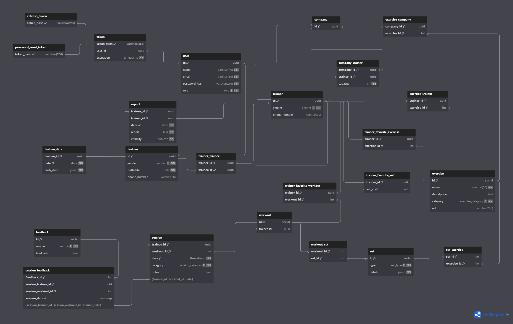

# Weekly Report 5

## Week: 15/04/2024 - 21/04/2024

## Summary

- **Week´s Objectives:**
    1. Implement methods to make training plans and exercises and more methods to manage them.
    2. Continue implementing the user controller.
    3. Improve backend error handling.
    4. Improve frontend error handling.
    5. Implement views to register trainees and hired trainers.
    6. Study the implementation of a calendar to schedule training sessions and see the schedule.
- **Progress:**
    1. Implemented methods to manage hired trainers ('assignTrainer', 'reassignTrainer', and 'updateTrainerCapacity').
    2. Updated authenticated signup for hired to recieve the trainer capacity.
    3. Implemented a method to retrieve the authenticated user's information.
    4. Improved backend error handling.
    5. Enhanced the database schema to support superseries.
    6. Implemented the view for Reset Password working with the backend.
    7. Some improvements in the comunication between the frontend and backend.
    8. Implemented the profile view for the user.
    9. Bigining the implementation of the calendar component.

---

## Frontend changes

Over the course of the week, several modifications were implemented in the AuthServices within the application’s FrontEnd, primarily to ensure the ResetPassword function effectively integrates with the API.

In addition, several new views was developed and incorporated additional components into existing ones. Notably, a calendar component was introduced on the home page, which becomes accessible once a user signs in, thereby providing them with an overview of their training sessions.

Furthermore, a profile page was created to display user information such as name, birthday, weight, height, BMI, Trainer, among other personal details without backend integration.

The remaining task to be completed involves the implementation of the signup page for both trainees and hired trainers

---

## Backend changes

The backend was updated to include methods to manage hired trainers, such as 'assignTrainer', 'reassignTrainer', and 'updateTrainerCapacity'. These methods allow the user to assign a trainer to a trainee, reassign a trainer, and update the trainer's capacity, respectively. The 'assignTrainer' method before assigning a trainer to a trainee, checks if the trainer has the capacity to take on another trainee. If the trainer has the capacity, the trainer is assigned to the trainee; otherwise, an error message is returned.

The authenticated signup for hired trainers was updated to receive the trainer's capacity. This information is used to verify if the trainer has the capacity to take on another trainee.

A method to retrieve the authenticated user's information was implemented. This method allows the user to retrieve their information, such as name, email, and role sending to the api the access token.

The error handling in the backend was improved to provide more detailed error messages to the user. The exception capture by the error handler was reviewed to ensure that the error messages are clear and informative.

---

## Database changes

The database schema was enhanced to support superseries. The tables related to training were updated introducing a new table to store the sets of exercises. This table sotores the type of set (dropset or superset) and respective details in JSON format. This table is associated with the exercise table and with the workout table.

In this way, the tables were changed to the following:

---

## Planning for Next Week

- **Objectives:**
    1. Start implementing the methods to manage training plans and exercises.
    2. Start implementing the methods to manage sessions.
    3. Start implementing a system to manage what methods the user can access in frontend.
    4. Implement the views to register trainees and hired trainers.
    5. Implement the views to the methods 'assignTrainer', 'reassignTrainer', and 'updateTrainerCapacity' in the frontend.
