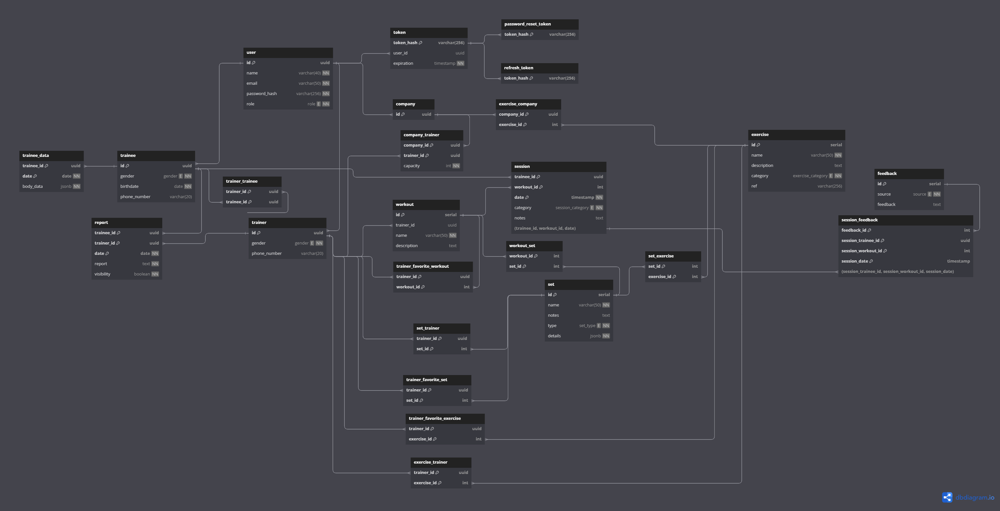

# Weekly Report 6

## Week: 22/04/2024 - 28/04/2024

## Summary

- **Week´s Objectives:**
    1. Start implementing the methods to manage training plans and exercises.
    2. Start implementing the methods to manage sessions.
    3. Start implementing a system to manage what methods the user can access in frontend.
    4. Implement the views to register trainees and hired trainers.
    5. Implement the views to the methods 'assignTrainer', 'reassignTrainer', and 'updateTrainerCapacity' in the frontend.
- **Progress:**
    1. Started implementing the methods to manage training plans and exercises.
    2. Started implementing the methods to manage sessions.
    3. Established connection between the API and the User Profile View.
    4. Implement the view to register trainees.

---

## Frontend changes

During this week some changes were made to the FrontEnd side of the project establishing connection between the API and the User Profile View, also the hired Trainer register View and his components were implemented.

---

## Backend changes

Some changes were made in forget password method so that when the user asks to recover his password, the oldest tokens associated with the user are deleted.

Besides that, the methods to manage training plans and exercises were started to be implemented. The methods to create exercises for a company or for a trainer and to create sets of exercises were implemented. The exercises are created with a name, description, type of exercise and url, which corresponds to the link to a video demonstration of the exercise. The sets of exercises are created with a name, notes about it and details about the set, these details contain the id of the exercise or the various exercises that make up the set. In addition, these details will contain more information about the set, depending on the type of set it is.

The details of the sets can depend on the type and may contain the following fields:

- **Dropset:**
    - **initialWeight:** Initial weight of the set.
- **Superset:** (These fields are repeated for each exercise that makes up the superset)
    - **exercise:** Id of the exercise that makes up the superset.
    - **reps:** Number of repetitions.
    - **weight:** Exercise weight.
- **Running:**
    - **distance:** Distance to run.
    - **time:** Time to run.
    - **speed:** Speed to run.
- **BodyWeight:**
    - **reps:** Number of repetitions.
    - **sets:** Number of sets.
- **WeightedLift:**
    - **reps:** Number of repetitions.
    - **sets:** Number of sets.
    - **weight:** Exercise weight.

This details after being converted from a `body` to a JSON object in Kotlin and properly validated are then converted back to a JSON object to be stored in the database.

In addition, an increment to the methods of creating sets and workouts was planned, which will allow the user to automatically generate a name for a workout or set that will follow the following format: `Workout/Set #` followed by the set of 3 digits that identifies the user's workout/set to which it belongs.

---

## Database changes

Some changes were made to the database, improving the `exercise_category` type by establishing the possible values that it can have.

The tables `workout` and `set` now have a mandatory `name` field, which is automatically generated if the user does not provide it by the API, a `description` field, for the `workout`, which is optional and a `notes` field for the `set`, which is not mandatory.

Besides that were created a new table to associate the `sets` to the trainers that created them.

In this way, the tables were changed to the following:

---

## Planning for Next Week

- **Objectives:**
    1. Continue implementing the methods to manage training plans and exercises.
    2. Continue implementing the methods to manage sessions.
    3. Start implementing a system to manage what methods the user can access in frontend.
    4. Finish the views to register trainees and hired trainers and integrate them with the backend.
    5. Implement the views to the methods 'assignTrainer', 'reassignTrainer', and 'updateTrainerCapacity' in the frontend.
