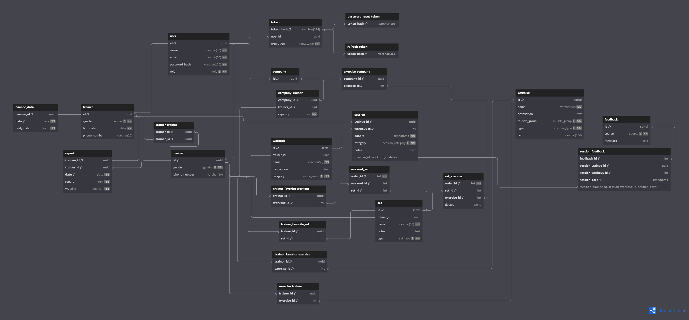

# Weekly Report 6

## Week: 29/04/2023 - 05/05/2023

## Summary

- **Week´s Objectives:**
    1. Continue implementing the methods to manage training plans and exercises.
    2. Continue implementing the methods to manage sessions.
    3. Start implementing a system to manage what methods the user can access in frontend.
    4. Finish the views to the methods 'assignTrainer', 'reassignTrainer', and 'updateTrainerCapacity' in the frontend.
- **Progress:**
    1. Implemented the methods to create custom exercises, sets and workouts.
    2. Implemented the methods to get the exercises, sets and workouts created by the user. 
    3. Implement the view to the methods 'assignTrainer'
---

## Frontend changes
This week we finish the connection between the frontend and the backend for the methods register hired Trainer and register Trainee, also we implemented the views for the company watch the list of trainers and trainees that are hired by the company, even tough we are having an issue with the API function that returns the list of trainers, we are working on it to fix it.  
Also we start implementing the view for the method assignTrainer, this view is on progress, we are working on it to finish it as soon as possible.

---

## Backend changes

The methods to create custom exercises, sets and workouts were implemented.

The exercises are created with a `name`, `description`, `muscleGroup`, `type` and `url`, which corresponds to the link to a video demonstration of the exercise, this `url` can only be from YouTube. The field `muscleGroup` correspond to the muscle group that the exercise works (*CHEST*, *BACK*, *SHOULDERS*, *BICEPS*, *TRICEPS*, *LEGS*, *ABS*, *CARDIO*) and the field `type` correspond to the type of exercise that it is (*BODYWEIGHT*, *WEIGHTLIFT*, *RUNNING_IN*, *RUNNING_OUT*, *CYCLING_IN*, *CYCLING_OUT*, *OTHER*).

The sets of exercises are created with a `name`, `notes` `type` and a list of exercises that make up the set and their details. The `type` field correspond to the type of set that it is (*SIMPLESET*, *DROPSET*, *SUPERSET*). The list of exercises that make up the set is a list of objects that contain the `exerciseId` and the `details` of the exercise. The `details` of the exercises can depend on the type of set and on the type of exercise that it is. This details are stored in a `Map<String, Any>` object that is converted to a JSON object to be stored in the database. This map are validated before being stored in the database, using a validator that checks if the fields are correct for the type of set and exercise that it is.

This details can contain the following fields:
- **SimpleSet:**
    - **Bodyweight:**
        - **reps:** Number of repetitions.
    - **WeightLift:**
        - **reps:** Number of repetitions.
        - **weight:** Exercise weight.
    - **OutdoorActivity:** (The outdoor activities include running and cycling) (In this case only one of the following fields can be present)
        - **distance:** Distance to run.
        - **time:** Time to run.
    - **IndoorRunning:** (In this case the request can only have distance or time and the other fields)
        - **distance:** Distance to run.
        - **time:** Time to run.
        - **speed:** Speed to run.
        - **incline:** Incline of the treadmill.
    - **IndoorCycling:** (In this case the request can only have distance or time and the other fields)
        - **distance:** Distance to cycle.
        - **time:** Time to cycle.
        - **resistance:** Resistance of the bike.
- **DropSet and SuperSet:**
    - **Bodyweight:** (These type of exercises does not need details)
    - **WeightLift:**
        - **InitialWeight:** Initial weight of the set.
        - **FinalWeight:** Final weight of the set.

The validators for the details of the exercises of the sets receive the type of set and the type of exercise and check if the fields are correct for the type of set and exercise that it is. This validators receive the details as a `Map<String, Any>` object and return a `Map<String, Any>` object with the fields that are correct for the type of set and exercise that it is, if there are fields that are not correct, the validator returns a `Map<String, Any>` object with the correct fields, if there are fields that are missing, the validator throws an exception to the user.

The method to create a custom workout receives a `name`, `description`, `category` and a list of ids of the sets that make up the workout. The `category` field correspond to the category of the workout or muscle group that it works (*CHEST*, *BACK*, *SHOULDERS*, *BICEPS*, *TRICEPS*, *LEGS*, *ABS*, *CARDIO*). The list of ids of the sets that make up the workout is validated to check if the sets exist and then associated with the workout.

The methods to create custom sets and workouts were made in a way that if the user does not provide a name for the set or workout, the system automatically generates a name for the set or workout that will follow the following format: `Set #` or `Workout #` followed by one or more digits that identifies the user's set or workout to which it belongs.

Besides that, the methods to create custom sets and workouts generate an id based in the order of the sets or exercises that the user wants to add to the set or workout. This id is generated in the API and then stored in the database. This id is used to identify the order of the sets or exercises in the set or workout, this id is important to ensure that when the user wants to get the sets or exercises of a set or workout, they are returned in the correct order.

---

## Database changes

Some changes were made to the database, to achieve the requirements of the new methods.

There were created 3 new types, `muscle_group`, `set_type` and `exercise_typ`, that establish the possible values, and added new fields to store elements of these types in the tables `exercise`, `set` and `workout`.

In the table `workout_set` and `set_exercise` were added a new field `order_id` that stores the order of the sets or exercises in the workout or set. Besides that, the table `set_exercise` now stores the details of the exercises in the sets, this details are stored in a `JSON` object.

In this way, the tables were changed to the following:

---

## Planning for Next Week

- **Objectives:**
    1. Improve the methods to create custom exercises, sets and workouts.
    2. Start implementing the methods to manage sessions.
