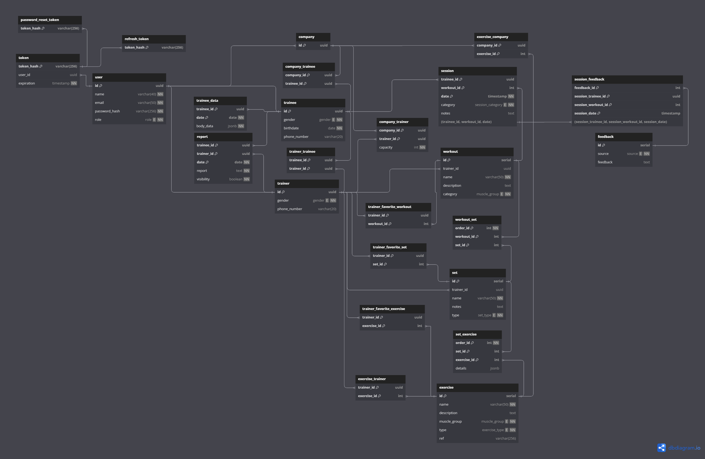

# Weekly Report 8

## Week: 06/05/2024 - 12/05/2024

## Summary

- **Week´s Objectives:**
    1. Improve the methods to create custom exercises, sets and workouts.
    2. Start implementing the methods to manage sessions.
    3. Finish implementing a system to manage what methods the user can access in frontend.
    4. Finish the views to the methods 'assignTrainer', 'reassignTrainer', and 'updateTrainerCapacity' in the frontend.
- **Progress:**
    1. Improved the methods to create custom exercises, sets and workouts.
    2. Implemented the method to get the trainees from a company. 

  //Minha Parte 
     3. Finish the views to the methods 'reassignTrainer' in the frontend. 
     4. Start the implementation of the views to create workouts, sets and exercises.
---

## Frontend changes
The reassignTrainer view was implemented with a form to reassign a trainer to a trainee.

This week were implemented the views to the methods 'assignTrainer' 'reassignTrainer', also was started the implementation of the Exercises and Create exercises views.

The Exercises view was implemented with a list of exercises that can be filtered by name, tags, etc. and the CreateExercise view was implemented with a form to create a new exercise.
    
---

## Backend changes

The method to get the trainees from a company was implemented, with a filter, and the method to get the trainers from a company was improved introducing filters for the search.

The filters implemented for these methods are the following:

- **getCompanyTrainees:**
    - **gender:** Gender of the trainee to search.
    - **name:** Name of the trainee that is intended to search.

- **getCompanyTrainers:**
    - **gender:** Gender of the trainer to search.
    - **availability:** Availability, ascending or descending, of the trainer according to the capacity of trainee that supports (capacity - associated trainees).
    - **name:** Name of the trainer that is intended to search.

Besides that, a bug was detected in which if a *hired trainer* was removed from the system, the trainees associated with him, were no longer associated with the company to which they belonged, in this way the trainee could not be associated with another *hired trainer*. To solve this problem, a new association was created between the company and the trainee, so that the trainee continues to be associated with the company even if the *hired trainer* is removed.

---

## Database changes

Some changes were made in the database to solve the problem of the bug detected, for this a new table was created to associate the company with the trainee, in this way, even if the *hired trainer* is removed, the trainee will continue to be associated with the company.

In this way, the tables were changed to the following:

---

## Planning for Next Week

- **Objectives:**
    1. Improve the methods to create custom exercises, sets and workouts.
    2. Implement the methods to list all the exercises, sets and workouts.
    3. Start implementing the methods to manage sessions.
    4. Finish the view CreateExercise and his connection with the backend. 
    5. Implement the Create workout view.

    